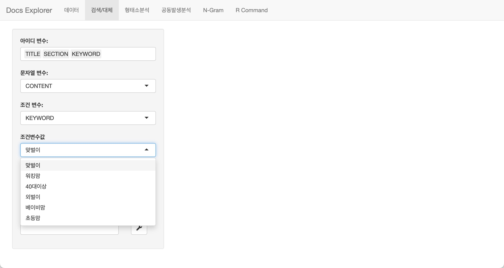
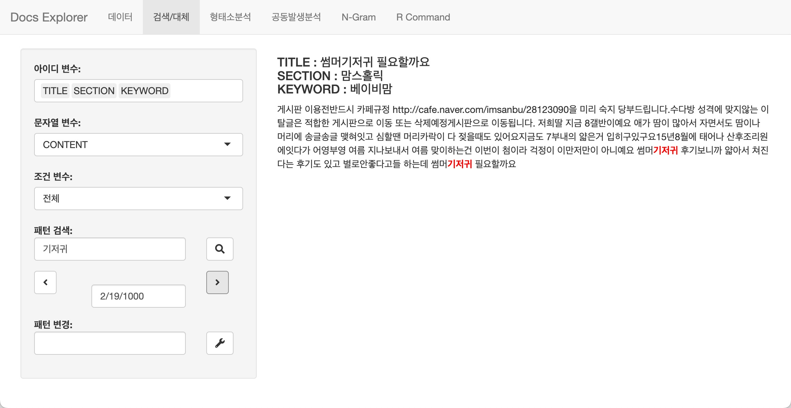
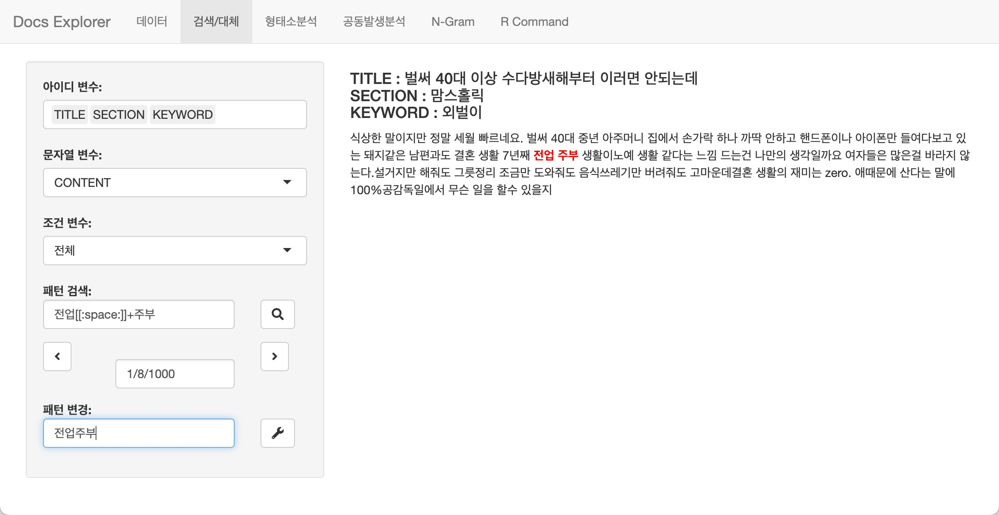
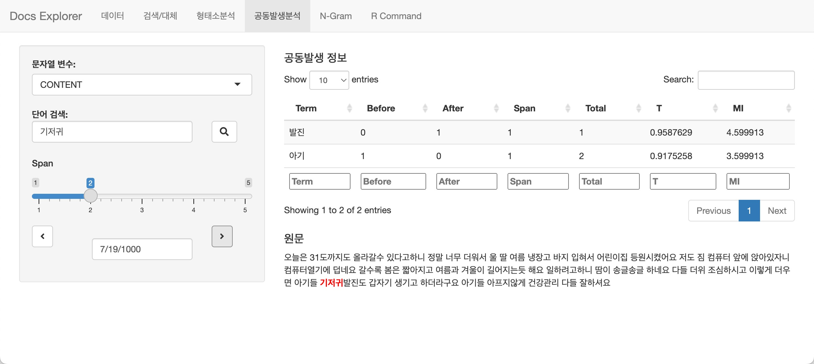
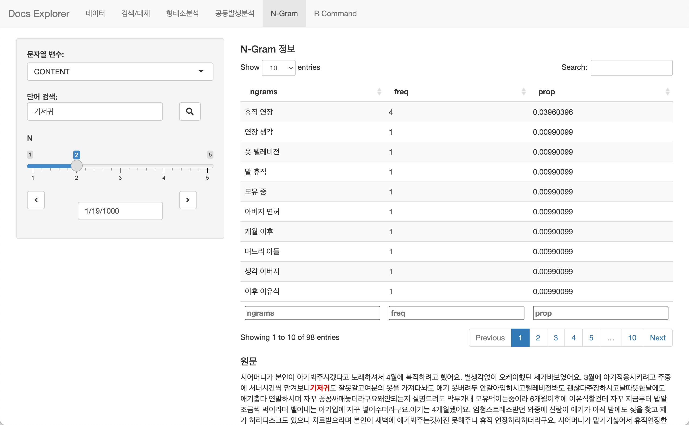
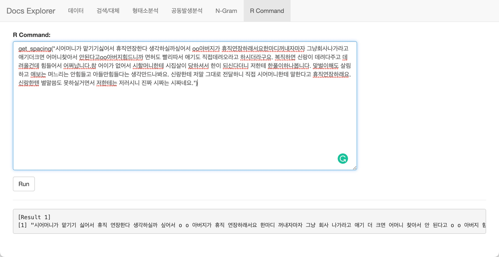

```{r environment, echo = FALSE, message = FALSE, warning=FALSE}
knitr::opts_chunk$set(collapse = TRUE, comment = "", out.width = "600px", dpi = 70,
                      echo = TRUE, message = FALSE, warning = FALSE)
options(tibble.print_min = 4L, tibble.print_max = 4L)
```

# 텍스트 데이터 탐색

데이터 분석을 위해서 데이터를 탐색(EDA, Exploratory Data Analysis)하는 것처럼 텍스트 데이터 분석 역시 데이터의 탐색이 필요합니다. 

이 작업을 통해 분석가는 주관적인 판단으로 데이터의 품질을 정성적으로 느끼거나, 데이터를 분석하기 위한 실마리를 찾습니다. 

데이터 품질의 인식은 데이터 정제의 패턴 룰을 발견하고, 필터링 룰을 도출하여 분석 대상 문서를 선별하는 작업의 기초가 됩니다.

### Text Data Explorer

bitNLP에는 `buzz`라는 데이터를 제공하는데 다음과 같은 변수를 가지고 있습니다. 변수 `CONTENT`를 대상으로 데이터를 탐색해야 합니다.

```{r}
names(bitNLP::buzz)
```
bitNLP는 텍스트 데이터를 탐색할 수 있는 `Text Data Explorer`를 제공합니다. `Text Data Explorer`는 Shiny 앱으로 `explore_docs()` 함수로 호출합니다.

```{r, echo=TRUE, eval=FALSE}
library(bitNLP)
data(buzz)

explore_docs()
```

## Text Data Explorer 기능

### 데이터 구조 파악하기

`Text Data Explorer`가 실행되면 다음과 같은, 분석할 데이터를 선택하고, 선택한 데이터의 변수 구조를 알수 있는 `데이터` 탭이 보여집니다. 현재는 데이터 프레임 객체가 buzz 하나라서 자동으로 해당 데이터가 선택되었습니다.

분석할 데이터 프레임 객체를 선택하면, 오른쪽 테이블에서는 데이터 프레임 객체의 변수 이름과 데이터 유형이 출력됩니다.

그리과 좌측에는 텍스트 데이터를 편집했을 경우, 데이터를 저장하는 기능의 위젯이 위치합니다. 

```{r, echo=FALSE, out.width='95%', fig.align='center', fig.pos="!h"}
knitr::include_graphics("images/data_tab.jpg")
```

### 데이터 탐색과 정제하기

텍스트 데이터를 탐색할 때 특히 하나의 문서가 아니라 여러 개의 문서들로 구성되었을 때, 문서를 하나씩 패치하여 읽어나가거나 정규표현식을 만족하는 문서만 추려서 하나씩 패치하면서 살펴봅니다. 경우에 따라서는 문서 내에서 오기된 단어들을 수정하기도 합니다. 

이러한 작업을 콘솔에서 수행하기에는 여간 성가신 것이 아닙니다. 또한 긴 문장으로 구성된 텍스트는 콘솔에서는 일부만 표현되기도 합니다.

`Text Data Explorer`는 텍스트 데이터를 탐색하고 정제할 수 있는 간단한 기능을 제공합니다. 이 기능은 `검색/대체` 탭을 사용합니다.

#### 탐색을 위한 변수 선택

데이터를 탐색하는 방법을 정의하는 과정입니다. 데이터 프레임 객체에서 대상 변수를 선택하는 과정입니다.

다음과 같은 변수를 선택합니다.

* 아이디 변수
  - 패치하면서 출력되는 문서를 식별하거나, 보조적 정보를 표현활 **변수들을 선택**합니다.
* 문자열 변수
  - 탐색할, 텍스트 분석의 대상이 데는 문서를 담은 **변수를 선택**합니다.
* 조건 변수
  - 탐색할 문서들 중에서 특정 조건에 해당하는 하위 집합을 정의할 변수를 선택합니다.
  - 범주형/문자형 데이터가 대상이됩니다.  
  - 조건변수값에서 해당 변수에서 탐색한 수준(levels)을 선택합니다.

다음 그림은 `buzz`의 `CONTENTS` 변수를 탐색하는데, 그 대상은 `KEYWORD`가 `맞벌이`인 데이터를 대상으로 합니다. 화면에는 `CONTENTS`와 함께 `TITLE`, `SECTION`, `KEYWORD`를 표시할 것입니다.    
```{r, echo=FALSE, out.width='95%', fig.align='center', fig.pos="!h"}

```

#### 검색

패턴 검색에 검색하려는 정규표현식을 입력한 후 검색 버튼을 누르면 다음처럼 정규표현식을 만족하는 문서들이 출력됩니다.

1000개의 문서들 중에서 19개의 문서에 검색 패턴인 `기저귀`가 포함되었으며, 그 중 첫번째 문서라는 것을 알려줍니다. 패턴과 매치되는 텍스트는 붉은색으로 표시됩니다.

```{r, echo=FALSE, out.width='95%', fig.align='center', fig.pos="!h"}
knitr::include_graphics("images/search.jpg")
```

#### 패치

오른쪽 방향 버튼을 누르면 두번째 문서화면으로 이동(패치)됩니다. 반대의 경우도 가능합니다.

```{r, echo=FALSE, out.width='95%', fig.align='center', fig.pos="!h"}

```

#### 대체

검색한 패턴을 다른 문자열로 대체할 수도 있습니다. 텍스트 데이터의 정제를 위한 기능입니다. 다음은 **`전업주부`**라는 복합명사(compound noun)가 **`전업 주부`**로 분리되어 있는 사례를 보정하는 예시입니다.

```{r, echo=FALSE, out.width='95%', fig.align='center', fig.pos="!h"}

```

> 만약에 대체 기능으로 텍스트 데이터를 수정(정제)하였다면, "데이터 구조 파악하기"에서 소개한 저장 기능을 이용해서 변경된 데이터를 저장해야 합니다.


### 형태소분석을 이용한 데이터 탐색

`형태소분석` 탭의 기능은 장문의 본문을 일일이 읽기 어려울 경우에 유용한 기능입니다. 원문과 함께 명사만 추출한 정보를 제공해서 명사를 탐색하면서 문장의 전체 맥락을 속성으로 이해할 수 있습니다. 

몇몇 개의 문서를 탐색하는 경우에는 문제가 발생하지 않지만, 하루 종일 수백, 수천개의 문서를 탐색하면서 텍스트 분석의 실마리를 찾아야하는 경우에 천사와 같은 기능을 제공해줄 것입니다.

```{r, echo=FALSE, out.width='95%', fig.align='center', fig.pos="!h"}
knitr::include_graphics("images/morpho.jpg")
```


### 공동발생분석을 이용한 데이터 탐색

`공동발생분석` 탭의 기능은 검색 키워드와 공동으로 발현(collocation)하는 명사들을 추출해줍니다. 관심있는 키워드와 함께 이야기하는 주제를 파악하기 쉽습니다.

입력 위젯의 `Span`은 공동발현하는 명사가 키워드를 중심으로 몇번 째 거리에서 출현하는가를 정의합니다. 즉, 아래 그림의 예제는 기저귀와 2번째 거리 이내의 명사를 리스트업합니다.

```{r, echo=FALSE, out.width='95%', fig.align='center', fig.pos="!h"}

```


### n-grams를 이용한 데이터 탐색

`N-Gram` 탭의 기능은 검색 키워드로 검색된 개별 문서에 대해서 명사를 n-gram으로 토큰화합니다. 

이 기능 역시 문서의 주제를 찾는데 유용합니다.

```{r, echo=FALSE, out.width='95%', fig.align='center', fig.pos="!h"}

```


## R 명령어 실행

bitNLP 패키지에서 실행한 Shiny 앱은 모달(Modal) 창을 띄웁니다. 이것은 앱이 종료되기 전는에 R 콘솔을 사용할 수 없다는 것을 의미합니다. 그래서 `Text Data Explorer`는 간단한 R 스크립트를 수행할 수 있는 기능을 구현했습니다.

`R Command` 탭은 간단한 R 스크립트를 수행할 수 있습니다. 다음 예제는 `Text Data Explorer`를 사용중에 `get_spacing()`으로 문서의 띄어쓰기를 보정하는 예시입니다.

```{r, echo=FALSE, out.width='95%', fig.align='center', fig.pos="!h"}

```
