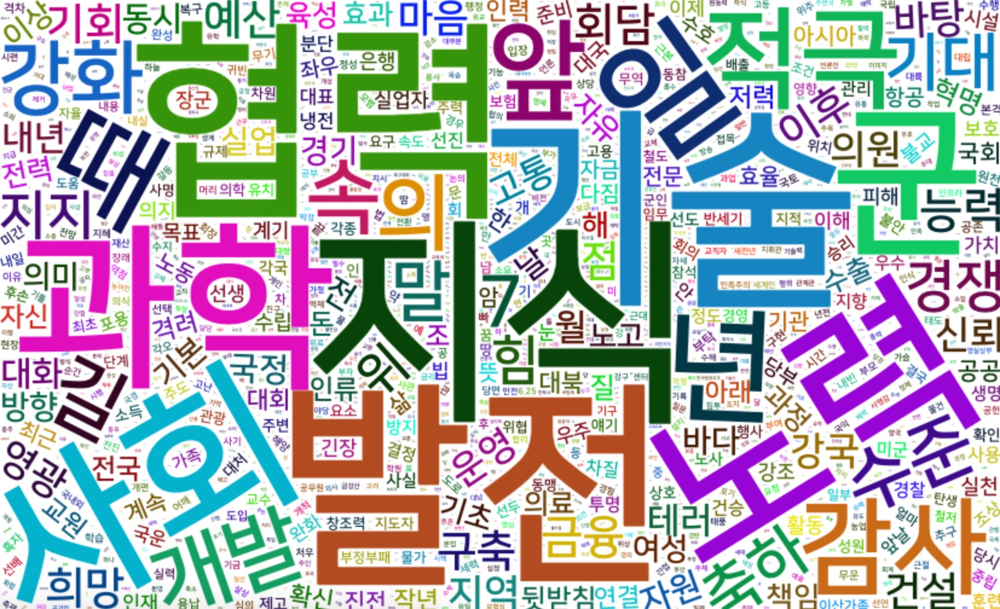

```{r environment, echo = FALSE, message = FALSE, warning=FALSE}
knitr::opts_chunk$set(collapse = TRUE, comment = "", out.width = "600px", dpi = 70,
                      echo = TRUE, message = FALSE, warning = FALSE)
options(tibble.print_min = 4L, tibble.print_max = 4L)
```

## 형태소분석

`bitNLP`는 은전한닢 형태소분석기를 이용하여 형태소 분석을 수행합니다. 이미 사용자는 형태소 분석기를 설치하였거나,
`install_mecab()` 함수를 이용해서 형태소 분석기를 설치한 것을 전제로 합니다.

## 은전한닢 형태소분석기 품사태깅

새종 품사와 은전한닢 형태소분석기인 mecab-ko의 품사 태그는 다음과 같습니다.

```{r, echo=FALSE}
library(dplyr)

class_l <- c(rep("실질형태소", 15), rep("형식형태소", 18), rep("", 11))

class_m <- c(rep("체언", 6), rep("용언", 5), rep("수식언", 3), "독립언",
             rep("관계언", 9), "선어말어미", rep("어말어미", 4), "접두사",
             rep("접미사", 3), "어근", rep("부호", 7), rep("한글 이외", 3))

tag_sejong <- c("NNG", "NNP", "NNB", "NNB", "NR", "NP", "VV", "VA", "VX", "VCP", 
                "VCN", "MM", "MAG", "MAJ", "IC", "JKS", "JKC", "JKG", "JKO", 
                "JKB", "JKV", "JKQ", "JX", "JC", "EP", "EF", "EC", "ETN", "ETM", 
                "XPN", "XSN", "XSV", "XSA", "XR", "SF", "SE", "SS", "SS", "SP", 
                "SO", "SW", "SL", "SH", "SN")
tag_mecab <- c("NNG", "NNP", "NNB", "NNBC", "NR", "NP", "VV", "VA", "VX", "VCP", 
               "VCN", "MM", "MAG", "MAJ", "IC", "JKS", "JKC", "JKG", "JKO", 
               "JKB", "JKV", "JKQ", "JX", "JC", "EP", "EF", "EC", "ETN", "ETM", 
               "XPN", "XSN", "XSV", "XSA", "XR", "SF", "SE", "SSO", "SSC", "SP", 
               "SY", "SY", "SL", "SH", "SN")

desc_sejong <- c("일반 명사", "고유 명사", "의존 명사", "의존 명사", "수사", 
                 "대명사", "동사", "형용사", "보조 용언", "긍정 지정사", 
                 "부정 지정사", "관형사", "일반 부사", "접속 부사", "감탄사", 
                 "주격 조사", "보격 조사", "관형격 조사", "목적격 조사", 
                 "부사격 조사", "호격 조사", "인용격 조사", "보조사", "접속 조사", 
                 "선어말 어미", "종결 어미", "연결 어미", "명사형 전성 어미", 
                 "관형형 전성 어미 ", "체언 접두사", "명사 파생 접미사", 
                 "동사 파생 접미사", "형용사 파생 접미사", "어근", 
                 "마침표, 물음표, 느낌표", "줄임표","따옴표,괄호표,줄표", 
                 "따옴표,괄호표,줄표", "쉼표,가운뎃점,콜론,빗금", 
                 "붙임표(물결,숨김,빠짐)", "기타기호 (논리수학기호,화폐기호)", 
                 "외국어", "한자", "숫자")

desc_mecab <- c("일반 명사", "고유 명사", "의존 명사", "단위를 나타내는 명사", 
                "수사", "대명사", "동사", "형용사", "보조 용언", "긍정 지정사", 
                "부정 지정사", "관형사", "일반 부사", "접속 부사", "감탄사", 
                "주격 조사", "보격 조사", "관형격 조사", "목적격 조사", 
                "부사격 조사", "호격 조사", "인용격 조사", "보조사", "접속 조사", 
                "선어말 어미", "종결 어미", "연결 어미", "명사형 전성 어미", 
                "관형형 전성 어미 ", "체언 접두사", "명사 파생 접미사", 
                "동사 파생 접미사", "형용사 파생 접미사", "어근", 
                "마침표, 물음표, 느낌표", "줄임표","여는 괄호 (, [", 
                "닫는 괄호 ), ]", "쉼표,가운뎃점,콜론,빗금", "", "", 
                "외국어", "한자", "숫자")

data.frame(class_l = class_l, class_m = class_m, tag_sejong = tag_sejong,
           desc_sejong = desc_sejong, tag_mecab = tag_mecab, 
           desc_mecab = desc_mecab) %>% 
  kableExtra::kable(
    col.names = c("실질의미유뮤", "대분류(5언+기타)", "태그", "설명", "태그 ", "설명 ")
  ) %>% 
  kableExtra::kable_styling(bootstrap_options = c("striped", "hover")) %>% 
  kableExtra::add_header_above(
    c(" " = 2, "세종 품사태그" = 2, "mecab-ko 품사태그" = 2))
```

## morpho_mecab()을 이용한 품사 태깅과 토큰화

### 함수의 원형

`morpho_mecab()` 함수가 `은전한닢 형태소분석기`를 인터페이스합니다.

```{r}
library(bitNLP)

args(morpho_mecab)
```

`morpho_mecab()` 함수의 인수는 다음과 같습니다.

* x	
  - character. 형태소 분석에 사용할 document.
* type	
  - character. 형태소 분석의 결과 유형.모든 품사, 명사, 동사 및 형용사와 같은 토큰화 결과 유형을 지정. 
  - "morpheme", "noun", "noun2", "verb", "adj"중에서 선택. 기본값은 "noun"로 일반명사만 추출함.
* indiv	
  - logical. 복수개의 문서일 때 개별 문서를 리스트로 반환할 지를 선택함. 
  - TRUE이면 개별 리스트로 반환하고, FALSE이면 하나의 문자 벡터로 반환함. 기본값은 TRUE
* user_dic	
  - mecab-ko 형태소 분석기의 사용자 정의 사전 파일. 기본값은 NULL로 사용자 사전파일을 지정하지 않음. 
  - 시스템 사전인 "/usr/local/lib/mecab/dic/mecab-ko-dic"(Linux, Mac)를 보완하여 사용됨. 
  - 사용자 사전 파일은 mecab-dict-index 명령어로 생성되며, 확장자가 "dic"임.

### 품사 태깅

문서에 품사를 태깅하기 위해서는 `type` 인수에 "morpheme"를 지정하고, `morpho_mecab()`를 호출합니다. 이 함수는 문서를 품사 단위로 토큰화합니다.
이때, 결과는 문자 벡터를 반환하며, 품사의 벡터의 이름으로 태깅됩니다. 다음 예에서 "님"은 일반명사인 "NNG"로 태그되었습니다.

굳이 소제목을 광의의 `품사 기반의 토큰화`가 아닌 협의의 `품사 태깅`이라 표현한 것은 모든 품사를 토큰화하였기 때문입니다. 

```{r}
morpho_mecab("님은 갔습니다. 아아, 사랑하는 나의 님은 갔습니다.",  type = "morpheme")
```

만약에 형태소 분석에 사용할 문서가 2개 이상일 경우에는 개별 문서를 리스트의 성분으로 반환합니다.

```{r}
docs <- c("님은 갔습니다. 아아, 사랑하는 나의 님은 갔습니다.",
          "푸른 산빛을 깨치고 단풍나무 숲을 향하여 난 작은 길을 걸어서, 차마 떨치고 갔습니다.")
morpho_mecab(docs,  type = "morpheme")
```

그런데 여러 개의 문서를 개별로 처리하지 않고, 하나의 문서처럼 묶어 처리할 수 도 있습니다. 
다음처럼 `indiv` 인수값에 FALSE를 지정하면 됩니다.

```{r}
morpho_mecab(docs, indiv = FALSE, type = "morpheme")
```

### 품사 토큰화

텍스트 분석에서 명사만 추출하여 문서의 맥락을 이해하는 방법이 일반적입니다. 그래서 `morpho_mecab()` 함수의 `type` 인수의 기본값이 "noun"입니다.

명사만 토큰화해 봅니다.

```{r}
morpho_mecab(docs, indiv = FALSE)
```
인수값 "noun"는 일반명사만 추출합니다. 만약에 좀 더 많은 종류의 명사를 추출하기 위해서는 "noun2"를 사용합니다.

"noun2"는 태그가 "N"으로 시작하는 체언을 추출합니다.

```{r}
morpho_mecab(docs, indiv = FALSE, type = "noun2")
```

동사를 추출하기 위해서는 `type` 인수에 `"verb"를 사용합니다.

```{r}
morpho_mecab(docs, indiv = FALSE, type = "verb")
```

### 품사의 워드클라우드 그리기

명사를 추출하여 워드클라우드를 그려봅니다. bitNLP에 수록된 대통령 연설문 데이터셋인 `president_speech`에서 임의의 연설문 100개에서 일반명사를 추출 후 워드클라우드를 그려 봅니다.

```{r word-1, echo=TRUE, eval=FALSE}
library(dplyr)

president_speech$doc[1:100] %>% 
  morpho_mecab(indiv = FALSE) %>% 
  table() %>% 
  wordcloud2::wordcloud2(fontFamily = "NanumSquare")
```

```{r, echo=FALSE, out.width='80%', fig.align='center', fig.pos="!h"}
#| fig.alt: >
#|   대통령 연설문 명사 워드클라우드
knitr::include_graphics("images/wordcloud1.jpg")
```

<br>

보통 상위 랭크의 도수(Frequency)를 갖는 명사 토큰은 문서의 맥락을 파악하는 데 불필요한 토큰입니다. 마치 상투어 같은 역할만 합니다. 그래서 경우에 따라서 이를 제거하는 것도 유용할 수 있습니다.

상위 10위 도숫를 갖는 명사 토큰을 제거 후 워드클라우드를 그려 봅니다.

```{r word-2, echo=TRUE, eval=FALSE}
president_speech$doc[1:100] %>% 
  morpho_mecab(indiv = FALSE) %>% 
  table() %>% 
  sort(decreasing = TRUE) %>% 
  .[-c(1:10)] %>% 
  wordcloud2::wordcloud2(fontFamily = "NanumSquare")
```

```{r, echo=FALSE, out.width='80%', fig.align='center', fig.pos="!h"}
#| fig.alt: >
#|   대통령 연설문 명사 워드클라우드

```


## 사용자 정의 사전 사용하기

형태소 분석기의 사전은 우리가 이야기하고, 글로 적는 모든 사례의 언어를 포함하지 못합니다. 일종의 샘플링 데이터입니다. 그러므로 품사 태깅의 오류가 반드시 따라오게 됩니다. 특히 과학, 예술, 의료 등과 같은 전문 영역에서는 그 빈도가 높아집니다. 이 경우에는 오분류하는 품사를 보정하기 위해서 시스템 사전을 개선하던가 사용자 사전을 추가하게 됩니다.

### 사용자 사전을 이용한 품사 토큰화

다음 문서의 일반명사 추출 결과를 보면 성능이 썩 좋지 않습니다. 많은 복합명사가 쪼개졌습니다. 

```{r}
str <- "신혼부부나 주말부부는 놀이공원 자유이용권을 즐겨 구매합니다."
morpho_mecab(str)
```

bitNLP 패키지에 포함된 샘플 사용자 정의 사전을 적용하기 위해서 `user_dic` 인수를 사용하였습니다.
결과를 보면 사용자 정의 사전을 사용하지 않았던 결과의 오류가 개선되었습니다.

```{r}
dic_path <- system.file("dic", package = "bitNLP")
dic_file <- glue::glue("{dic_path}/buzz_dic.dic")

morpho_mecab(str, user_dic = dic_file)
```

### 사용자 사전 정의하기

TO-DO

### 사용자 사전 컴파일하기

TO-DO
